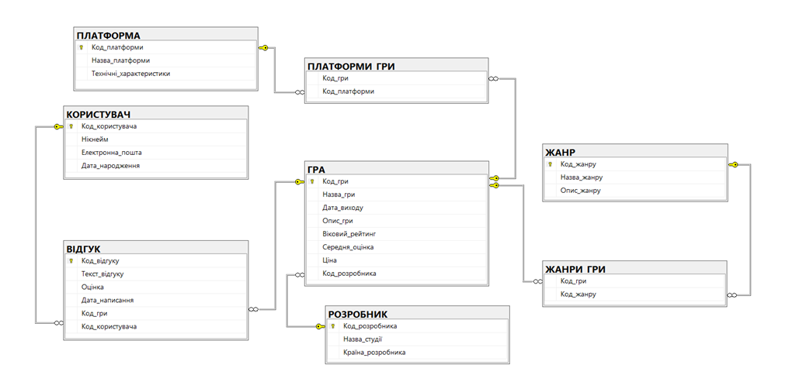

# Video Game Database & Analytics System (T-SQL)

A relational database management system (RDBMS) designed to store, manage, and analyze video game industry data, including titles, developer studios, platforms, genres, users, and player reviews. 

The project focuses on data integrity, advanced analytical query optimization, and real-time data synchronization using database triggers.

## 🚀 Key Features & Architectural Capabilities
* **Robust Relational Model:** Optimized schema handling many-to-many relationships (Games <-> Platforms, Games <-> Genres) via junction tables.
* **Real-time Rating Synchronizer:** Advanced automation trigger that dynamically recalculates and updates a game's global rating (`Середня_оцінка`) upon any review insertion, update, or deletion.
* **Data Sanitization & Constraints:** Custom triggers functioning as data-layer guardrails to prevent negative pricing, restrict ratings to a 1-10 scale, and protect historical release records.
* **Complex Analytical Queries:** Comprehensive reporting scripts featuring deep conditional logic (`CASE`), aggregation filters (`HAVING`), pattern matching (`LIKE`), and multi-table junctions (`JOIN`).

## 🛠️ Tech Stack
* **RDBMS:** Microsoft SQL Server (MS SQL)
* **Language:** T-SQL (Transact-SQL)
* **IDE:** SQL Server Management Studio (SSMS)

## 📊 Database Schema (Datalogical Model)



The system consists of the following core entities:
* `ГРА` (Game) - Central catalog of titles with global pricing, release metrics, and ratings.
* `РОЗРОБНИК` (Developer) - Studio tracking and geographical profiling.
* `КОРИСТУВАЧ` (User) - Authenticated gaming profiles and demographics.
* `ВІДГУК` (Review) - Player-generated telemetry, ratings, and textual feedback.
* `ЖАНР` & `ПЛАТФОРМА` (Genre & Platform) - Metadata dictionaries.

## 💾 Project Structure
* `schema.sql` — Data Definition Language (DDL) scripts for building tables, constraints, and relationships.
* `data_insertion.sql` — Seed data populated with realistic industry items (e.g., HoYoverse, CD Projekt RED titles) for staging environment testing.
* `queries_and_triggers.sql` — Analytical queries, View architectures, and transactional automation logic.

## ⚡ Automation Logic Examples

### Real-Time Live Rating Recalculation Trigger
This trigger ensures the `Середня_оцінка` (Average Rating) field inside the `ГРА` table stays fully up-to-date in real-time, eliminating the need for expensive daily cron-job recalculations:

```sql
CREATE TRIGGER триг_ОновлОцінки
ON ВІДГУК
AFTER INSERT, UPDATE, DELETE
AS
BEGIN
    SET NOCOUNT ON;
    UPDATE ГРА
    SET Середня_оцінка = (
        SELECT AVG(CAST(Оцінка AS FLOAT)) 
        FROM ВІДГУК 
        WHERE ВІДГУК.Код_гри = ГРА.Код_гри
    )
    WHERE Код_гри IN (SELECT Код_гри FROM inserted UNION SELECT Код_гри FROM deleted);
END;
